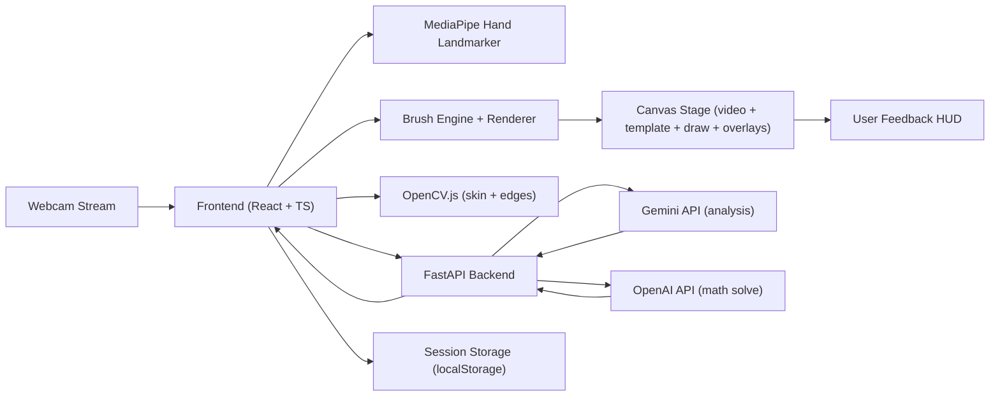

# Architecture and Data Flow

## Subsystems

- **CV Pipeline**: webcam frame -> MediaPipe landmarks -> gesture state machine -> drawing commands.
- **Drawing Engine**: layered stroke model with brush effects, symmetry, undo/redo, export.
- **Creative Assist**: template overlays + shape beautify + replay generation.
- **AI Services**: backend proxy where Gemini handles analysis and OpenAI handles math solving (Gemini fallback), with schema normalization and error handling.
- **Persistence**: session records saved in browser localStorage with previews and analytics.

## Runtime Loop

1. Read current webcam frame.
2. Detect landmarks via MediaPipe.
3. Classify gesture with temporal confirmation (`GestureProcessor`).
4. Dispatch action (draw/erase/undo/AI/math trigger).
5. Render layers + cursor.
6. Optionally run OpenCV skin/edge overlays on sampled frames.
7. Update HUD metrics.
